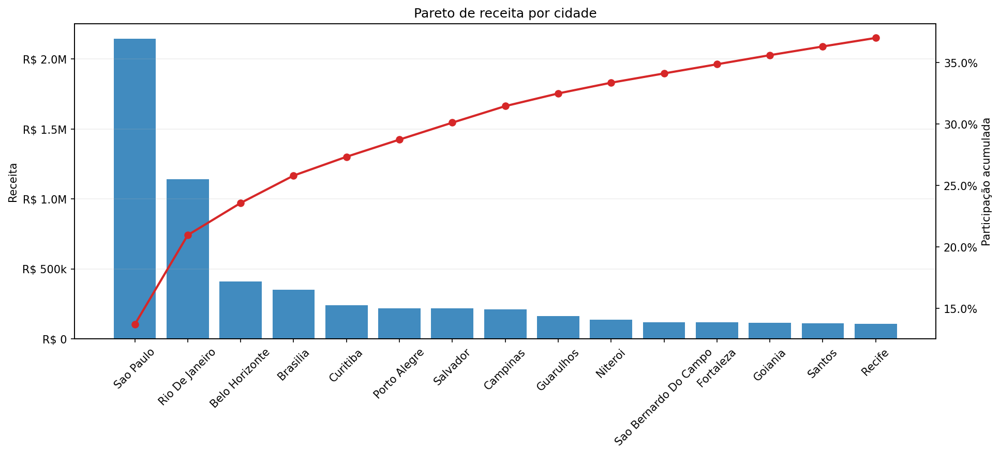
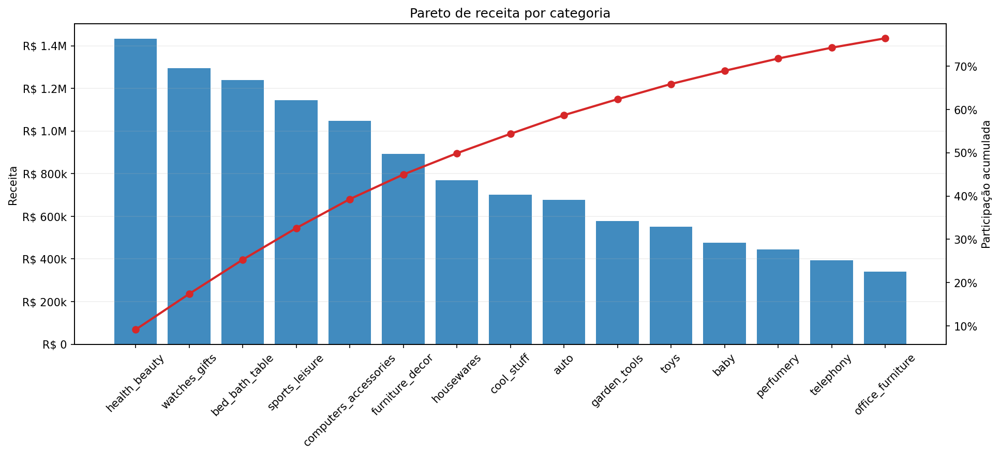
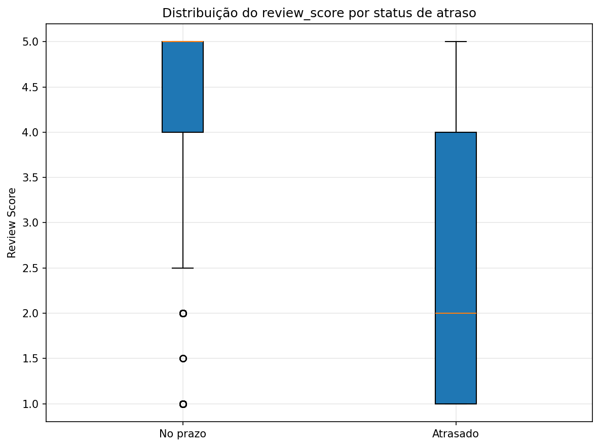
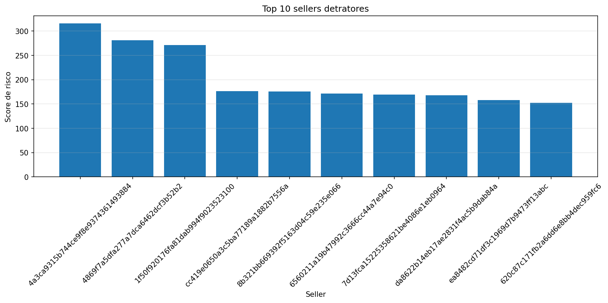
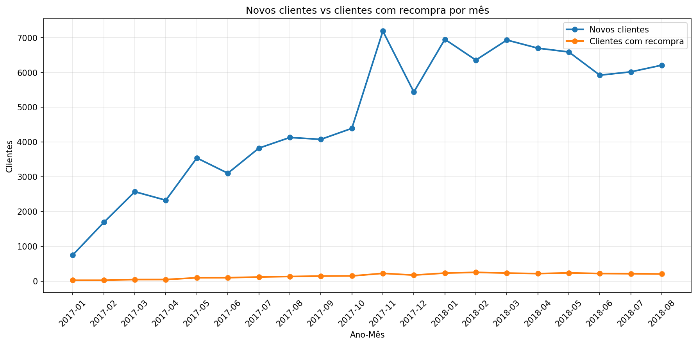

# Analise Estatistica Olist - Versao Revisada para Storytelling Executivo

## Objetivo desta revisao

Este documento reorganiza a saida estatistica do Python para fortalecer a apresentacao executiva sem forcar conclusoes que os dados nao sustentam. O foco ficou em:

- manter apenas evidencias coerentes e defensaveis na narrativa principal;
- mover leituras sensiveis para apendice tecnico;
- retirar regressao e simulacao do escopo do Python;
- preservar a tese central com linguagem segura: associacao, leitura observada e priorizacao.

## Curadoria executiva do material

### Graficos mantidos na apresentacao principal

- `pareto_receita_cidade.png`: sustenta que o crescimento existe, mas esta concentrado em poucos polos geograficos.
- `pareto_receita_categoria.png`: mostra que o valor tambem se concentra em algumas categorias lideres.
- `boxplot_review_por_atraso.png`: evidencia central de que atraso piora a percepcao de valor.
- `top_10_sellers_detratores.png`: mostra que o problema logistico pode ser priorizado em sellers especificos.
- `novos_vs_recompra_mes.png`: sustenta que a aquisicao e muito maior do que a base com recompra.

### Graficos movidos para apendice tecnico

- `receita_mensal.png`: ajuda a mostrar tracao, mas nao precisa ser a prova central.
- `pedidos_mensais.png`: util como suporte de crescimento, sem ser headline.
- `pareto_receita_seller.png`: complementar para mostrar concentracao por seller.
- `categorias_recompra.png`: bom apoio para retencao seletiva, melhor no relatorio do que no slide principal.
- `dispersao_volume_vs_taxa_atraso_seller.png`: analitico e util para apendice.
- `controle_receita_mensal.png`, `controle_pedidos_mensais.png`, `controle_nota_media.png`: leitura exploratoria apenas.

### Graficos removidos da apresentacao principal

- `coeficientes_regressao.png`: removido porque pode contradizer a tese e depende de amostra mensal curta.
- `correlacao_drivers.png`: removido porque correlacao simples nao sustenta decisao executiva isoladamente.
- `comparacao_baseline_vs_cenario_m1.png`: removido porque a simulacao passou a ficar fora do Python.
- `receita_historica_vs_baseline.png`: removido pelo mesmo motivo da simulacao.
- `ticket_medio_grupo_recompra.png`: removido porque enfraquece a narrativa se lido como prova de maior valor.
- `taxa_atraso_mensal.png` e `controle_taxa_atraso.png`: removidos da narrativa principal ate reconciliar integralmente a formula com o dashboard.

## Narrativa estatistica revisada

### 1. Crescimento existe, mas e concentrado

- Top 10 cidades concentram **33,35%** da receita.
- Sao Paulo sozinha concentra **13,68%**.
- Top 5 categorias concentram **39,28%** e top 10 categorias **62,37%**.
- Top 10 sellers concentram **12,89%** da receita.

Texto executivo sugerido:
> Os dados sugerem que a Olist ganhou escala comercial, mas com dependencia relevante de poucos polos geograficos, categorias lideres e um grupo restrito de sellers. Isso reforca tracao, mas tambem indica concentracao de risco e de oportunidade.

### 2. Atraso destroi valor percebido

- Nota media no prazo: **4,30**
- Nota media com atraso: **2,57**
- Gap absoluto: **1,73 pontos**
- Variacao relativa: **-40,24%**
- Teste de Mann-Whitney: **p=<0,001**
- Spearman atraso vs nota: **rho=-0,30 | p=<0,001**

Texto executivo sugerido:
> Ha evidencia estatistica de associacao entre atraso logistico e pior satisfacao. O comportamento observado aponta que logistica deve ser tratada como tema de experiencia e reputacao, e nao apenas de eficiencia operacional.

### 3. O problema logistico e priorizavel

- O score de risco foi definido como `volume_pedidos * taxa_atraso * impacto_na_nota`.
- O ranking prioriza sellers com volume suficiente para acao pratica.
- A leitura correta e de priorizacao operacional, nao de causalidade individual.

Texto executivo sugerido:
> O problema logistico nao e homogeneo. A analise indica que parte relevante do risco esta concentrada em sellers especificos, o que permite plano direcionado em vez de acao generica sobre toda a base.

| seller_id | seller_orders | late_rate | avg_delay_days | avg_review_score | risk_score |
| --- | --- | --- | --- | --- | --- |
| 4a3ca9315b744ce9f8e9374361493884 | 1772 | 11,00% | 1,17 | 3,85 | 315,80 |
| 4869f7a5dfa277a7dca6462dcf3b52b2 | 1124 | 11,57% | 1,05 | 4,15 | 281,37 |
| 1f50f920176fa81dab994f9023523100 | 1399 | 10,58% | 1,01 | 4,14 | 271,00 |
| cc419e0650a3c5ba77189a1882b7556a | 1651 | 6,12% | 0,46 | 4,15 | 176,15 |
| 8b321bb669392f5163d04c59e235e066 | 930 | 10,43% | 0,93 | 4,10 | 175,55 |
| 6560211a19b47992c3666cc44a7e94c0 | 1819 | 6,43% | 0,45 | 3,98 | 171,30 |
| 7d13fca15225358621be4086e1eb0964 | 558 | 12,19% | 1,40 | 4,04 | 169,60 |
| da8622b14eb17ae2831f4ac5b9dab84a | 1311 | 7,63% | 0,82 | 4,18 | 167,69 |
| ea8482cd71df3c1969d7b9473ff13abc | 1132 | 10,42% | 0,77 | 4,03 | 157,70 |
| 620c87c171fb2a6dd6e8bb4dec959fc6 | 699 | 10,30% | 1,04 | 4,29 | 152,63 |

### 4. Recompra e oportunidade, nao prova isolada de valor

- Clientes unicos: **94.703**
- Frequencia media: **1,03 compras por cliente**
- Clientes com recompra: **3,04%**
- Receita da base com recompra: **R$ 886.560,94**

Texto executivo sugerido:
> A recompra ainda e pequena frente ao volume de aquisicao. Isso nao invalida a agenda de retencao; ao contrario, sugere que existe espaco para expansao seletiva nas categorias que ja mostram tracao dentro da base recorrente.

Categorias mais relevantes dentro da base com recompra:

| product_category_final | item_revenue | share |
| --- | --- | --- |
| bed_bath_table | R$ 117.790,67 | 13,29% |
| sports_leisure | R$ 87.049,48 | 9,82% |
| furniture_decor | R$ 79.087,92 | 8,92% |
| computers_accessories | R$ 72.204,22 | 8,14% |
| health_beauty | R$ 64.467,84 | 7,27% |
| watches_gifts | R$ 57.394,58 | 6,47% |
| housewares | R$ 42.566,45 | 4,80% |
| toys | R$ 25.710,92 | 2,90% |
| garden_tools | R$ 25.298,94 | 2,85% |
| auto | R$ 24.687,43 | 2,78% |

### 5. Sellers estrategicos e cenario futuro

- O Python manteve apenas a identificacao operacional de sellers estrategicos por score composto de receita, pedidos e itens.
- O grupo estrategico definido no recorte responde por **11,65%** da receita consolidada do grupo.
- A simulacao e a regressao ficaram fora deste material e devem ser tratadas na versao validada em Excel.

Texto executivo sugerido:
> A leitura mais defensavel e usar sellers estrategicos como frente de expansao seletiva, apoiada por retencao e disciplina operacional. O cenario numerico deve ser apresentado separadamente, como hipotese validada fora deste relatorio Python.

## Recomendacao de uso em apresentacao

### Entram na apresentacao principal

- Pareto por cidade
- Pareto por categoria
- Boxplot de review por atraso
- Top 10 sellers detratores
- Novos clientes vs clientes com recompra

### Ficam no apendice tecnico

- Dispersao volume vs taxa de atraso por seller
- Serie de receita e pedidos
- Graficos de controle
- Categorias da base com recompra
- Pareto de receita por seller

## Alertas de consistencia antes da defesa

- Validar a taxa de atraso do Python contra a definicao usada no Power BI: pedidos atrasados / pedidos entregues com datas validas.
- Nao usar ticket medio por grupo de recompra como headline.
- Nao usar regressao, correlacao simples ou simulacao do Python para sustentar causalidade.
- Revisar slides antigos com numeros hardcoded para evitar divergencia com a base tratada.

## Fontes e filtros aplicados

Os CSVs foram lidos automaticamente a partir de `C:\Users\Pichau\Desktop\Pos Data Analytics\Tech Challenge\bases`. Arquivos carregados:

- `customers`: olist_customers_dataset.csv | linhas=99441 | separador=`,` | encoding=`utf-8-sig`
- `orders`: olist_orders_dataset.csv | linhas=99441 | separador=`,` | encoding=`utf-8-sig`
- `order_items`: olist_order_items_dataset.csv | linhas=112650 | separador=`,` | encoding=`utf-8-sig`
- `order_payments`: olist_order_payments_dataset.csv | linhas=103886 | separador=`,` | encoding=`utf-8-sig`
- `order_reviews`: olist_order_reviews_dataset.csv | linhas=99224 | separador=`,` | encoding=`utf-8-sig`
- `products`: olist_products_dataset.csv | linhas=32951 | separador=`,` | encoding=`utf-8-sig`
- `sellers`: olist_sellers_dataset.csv | linhas=3095 | separador=`,` | encoding=`utf-8-sig`
- `geolocation`: olist_geolocation_dataset.csv | linhas=1000163 | separador=`,` | encoding=`utf-8-sig`
- `translation`: product_category_name_translation.csv | linhas=71 | separador=`,` | encoding=`utf-8-sig`

Filtros e regras principais:

- Recorte principal alinhado ao dashboard: pedidos a partir de `2017-01-01`.
- Pedidos sem `order_purchase_timestamp` foram descartados.
- A camada comercial excluiu `canceled` e `unavailable`.
- Meses residuais removidos nas bordas da serie: `['2018-09']`.
- Analise de atraso considera apenas pedidos entregues com datas validas.
- Quando havia mais de um review por pedido, a nota foi agregada pela media.

## Limitacoes

- A base e observacional e nao sustenta causalidade.
- Parte das leituras mensais pode ser sensivel a meses especificos e a amostra curta.
- Nem todo pedido recebeu review, o que pode introduzir vies de selecao.
- O score de seller detrator e uma ferramenta de priorizacao, nao diagnostico causal definitivo.

## Alertas tecnicos consolidados

- A regressao e a simulacao de cenario foram retiradas deste material Python e devem ser apresentadas apenas na versao validada em Excel.
- O grafico de taxa de atraso mensal nao deve entrar na apresentacao principal antes de reconciliar a definicao com o dashboard do Power BI.
- Graficos de controle ficam restritos ao apendice tecnico, porque a serie tem tendencia e nao representa processo estavel classico.
- Ha pico mensal de atraso acima do patamar medio em parte da serie. Esse comportamento deve ser validado antes de ser usado como headline.
- Plotly não está disponível. O candlestick mensal será ignorado.
